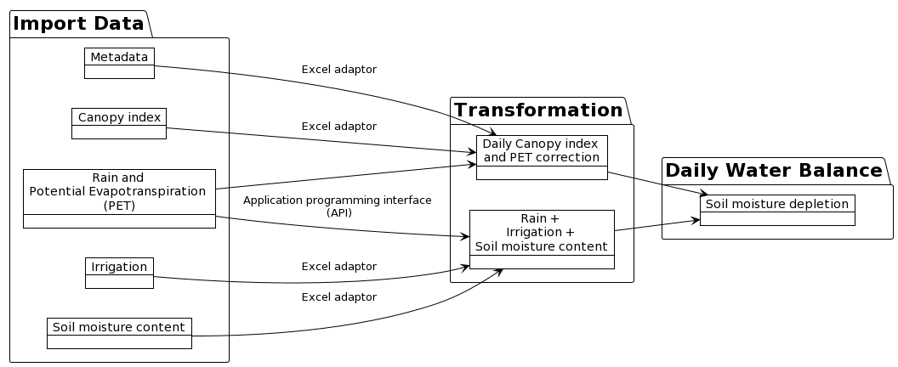

# Data pipeline for managing field experiments  

This is the repository where the magic begins




```
@startuml
!theme plain
left to right direction
' Horizontal lines: -->, <--, <-->
' Vertical lines: ->, <-, <->

package "Import Data" {
  object "Rain and PET" as ob1
  object "Irrigation" as ob2
  object "Soil moisture content" as ob3
  object "Canopy index" as ob4
  object "metadata" as meta
} 

package "Transformation"{
  object "Daily Canopy index \nand PET correction" as ob5
  object "Rain + Irrigation + Soil Moisture Content" as ob7

}

package "Daily Water Balance" {
  object "Soil moisture depletion" as ob8

}  


ob1 --> ob5
ob4 --> ob5: Excel adaptor
meta -> ob5: Excel adaptor

ob1 --> ob7: API
ob2 --> ob7: Excel adaptor
ob3 --> ob7: Excel adaptor

ob5 --> ob8
ob7 --> ob8
@enduml
```
